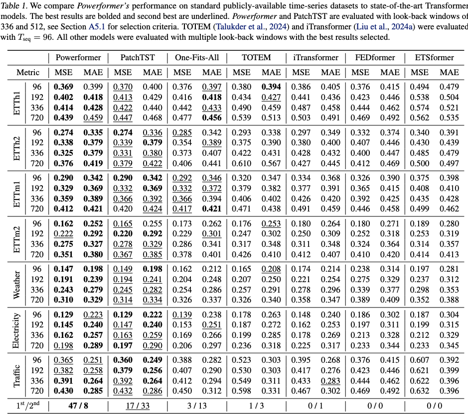

# Powerformer

### This is the official implementation of [Powerformer: A Transformer with Weighted Causal Attention for Time-series Forecasting](https://arxiv.org/abs/2502.06151). 

## Temporally Local and Causal Inductive Biases in Time-Series

Transformers have recently shown strong performance in time-series forecasting, but their all-to-all attention mechanism overlooks the (temporal) causal and often (temporally) local nature of data. We introduce Powerformer, a novel Transformer variant that replaces noncausal attention weights with causal weights that are reweighted according to a smooth heavy-tailed decay. More concretely, we impose a power-law decay on causally connected weights since pairwise temporal correlations in many datasets decay as a power-law. This simple yet effective modification endows the model with an inductive bias favoring temporally local dependencies, while still allowing sufficient flexibility to learn the unique correlation structure of each dataset. Our empirical results demonstrate that Powerformer not only achieves state-of-the-art accuracy on public time-series benchmarks, but also offers improved interpretability of attention patterns.

## Key Designs

Powerformer is a Transformer-based model that combines causal and local inductive biases with modern Transformer-based time-series model architectures. Our primary contribution is *Weighted Causal Multihead Attention* (WCMHA) which imposes local and causal inductive biases through an attention mask. Figure 1 shows Powerformer and WCMHA's architecture, along with WCMHA's effects on the attention weights. Here we highlight key changes to the traditional [Transformer](https://proceedings.neurips.cc/paper_files/paper/2017/file/3f5ee243547dee91fbd053c1c4a845aa-Paper.pdf) encoder-only architecture.


:star: **Weighted Causal Multihead Attention**: WCMHA imposes causal and local inductive biases onto the attention weight distribution by applying a mask to the key-query overlap score (as shown in Fig. 1). For noncausal connections the mask is $- \infty$, for causal connections we impose a power-law derived decay structure ($- \alpha$ log $(\Delta t)$ ) that results in a power-law decay in the attention weights (See our paper for details). 
* Powerformer can impose different locality-inducing masks with varying decay scales ($\alpha$), see below and our paper for details.
* The decay type and time scale act as regularizers and are therefore treated as hyperparameters.

:star: **Transformer Time-Series Inductive Bias**: By Replacing all traditional multihead self-attention with WCMHA we impose causal and local inductive biases that generate attention distributions that are well aligned with natural power-law pairwise correlation structures. Furthermore, WCMHA allows the attention mechanism to strongly attend to highly correlated structures within the heavy tail of the attention decay (see Fig. 1).

:star: **Patching**: Patching combines time-series data into subseries-level patches serving as input tokens to Transformer. Patching was introduced by [PatchTST](https://github.com/yuqinie98/PatchTST) and allows for a longer lookback window while removing noisy high-frequency components. 

:star: **Channel-independence**: Multivariate time-series data are separated into single univariate time-series that share the same embedding and Transformer weights across all multivariate channels. This method simplifies Powerformer's architecture and promotes interpretability, which is important to our work as we probed the effects of causal and local inductive biases on Transformer-based time-series model. This univariate decomposition was explored in [PatchTST](https://github.com/yuqinie98/PatchTST). 


## Results

### Comparison to Benchmark

Powerformer outperforms other state-of-the-art models on standard time-series benchmarks, as shown in Table 1. Powerformer achieves the best performance on 47 of the evaluation tasks, compared to the next best performing model [PatchTST](https://github.com/yuqinie98/PatchTST) which gets 17. 




### Interpretability

Powerformer was designed to explore the importance of local and causal biases by isolating and interpreting their effects. To do this, we designed Powerformer to be simple. In Fig. 2 we show the attention score (key and query overlap) and weight distribution before and after applying the local causal mask. The bimodal distribution in attention weights comes from amplified local connections (the right mode) and suppressed non-local connections (the left mode). Interestingly, Powerformer already imposes this bimodal distribution before the mask is applied. This ultimately increases the effect of the mask by further separating the modes. Since the mask is constant, Powerformer could mitigate or remove it through reweighting but instead amplifies the effects of our causal and local inductive bias. We consider this strong evidence for the importance of this local and causal bias.


## Getting Started

1. Install requirements. ```python3 -m pip install -r requirements.txt```

2. Download data. You can download all the datasets from [Autoformer](https://drive.google.com/drive/folders/1ZOYpTUa82_jCcxIdTmyr0LXQfvaM9vIy), then place all subfolders in ```./datasets```.

3. Training. All the Powerformer run scripts are in the directory ```./scripts/Powerformer```. To run Powerformer one must set the hyperparameters in the run script and call the following command
```
sh ./scripts/Powerformer/weather.sh
```
The results for all experiments will be saved in ```./result.txt``` along with the log file.

4. Evaluation. To evaluate Powerformer and save the attention weight and score distributions use the flag ```--is_training 0``` and one of the following.
* ```--save_attn```: Saves the attention weight and score histogram distributions before and after applying the mask for the test set.
* ```--save_attn_matrices```: Saves attention matrices only for a few randomly selected test samples and will exit afterward.

## Hyperparameters and Important Flags
```--seq_len```: Input sequence length used to forecast future results.

```--pred_len```: The prediction forecast length.

```--label_len```: The number of latest time points in the sequence length to predict (generally this is 0) and add to the loss. For Transformer, these points are input for the decoder.

```--patch_len```: The number of time-steps in each patch.

```--stride```: The stride between patches.

```--attn_decay_type```: The type of temporally decaying mask that imposes locality, see below for options
* ```powerLaw``` ($- \alpha$ log $(\Delta t)$ ): Imposes a power-law decay on the attention weights
* ```simPowerLaw``` ($- (\Delta t)^{-\alpha}$): Adds a power-law to the key and query overlap which results in an exponential of this power-law in the attention weights.
* ```butter2```: This mask is based on the Butterworth filter and resembles a smooth step function.
* ```butter1```: This mask is based on the Butterworth filter and decays more slowly than ```butter2```, offering a decaying structure between ```butter2``` and ```powerLaw```.
* ```step```: This is a step function

```--attn_decay_scale```: This is the time constant ($\alpha$) of the attention weight decays.

```--train_attn_decays```: This option makes the attention decay scale ($\alpha$) learnable when using ```powerLaw``` or ```simPowerLaw``` decay types.


## Acknowledgement

We acknowledge and thank the [PatchTST](https://github.com/yuqinie98/PatchTST) authors for the use of their repository:

https://github.com/yuqinie98/PatchTST
